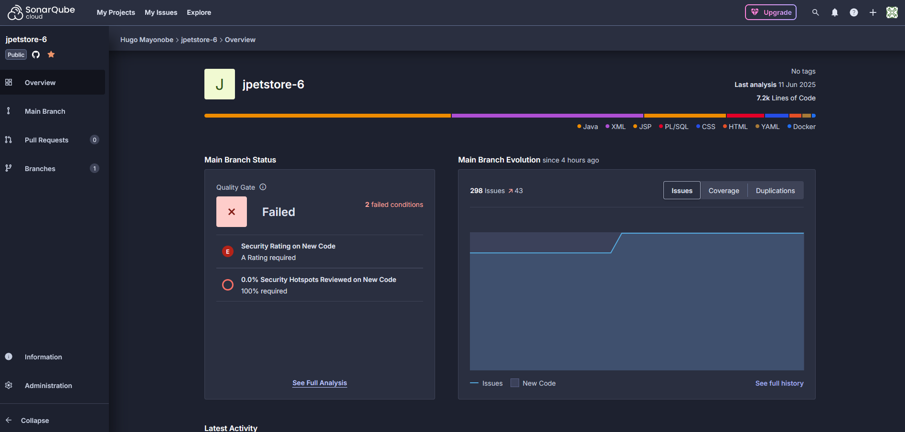

# CI/CD – JPetStore avec GitHub Actions

Ce projet utilise une pipeline CI/CD complète avec GitHub Actions pour tester, analyser, construire et publier automatiquement le projet Java.

---

## Étapes automatisées dans la CI

1. **Checkout du code**
2. **Installation de Java (JDK 17 via Zulu)**
3. **Cache du répertoire Maven `.m2`**
4. **Exécution des tests Maven (`mvn test`) avec serveur Tomcat lancé via Cargo**
5. **Compilation (`mvn compile`) pour SonarCloud**
6. **Analyse de code statique avec SonarCloud**
7. **Analyse sécurité de l'IaC avec Checkov (non bloquant)**
8. **Scan de vulnérabilités fichiers avec Trivy**
9. **Build Docker de l'application**
10. **Push de l'image sur Docker Hub**

---

## Problèmes rencontrés

### Tests qui échouaient dans GitHub Actions
- **Cause** : `mvn verify` arrêtait Tomcat **avant** que Selenide exécute les tests.
- **Fix** : utilisation directe de `mvn test`, qui laisse Cargo actif.

### Échec de l’analyse SonarCloud
- **Cause** : erreur `sonar.java.binaries missing` car les `.class` n’étaient pas présents.
- **Fix** : ajout d’une étape `mvn compile` et propriété `-Dsonar.java.binaries=target`.

### `sonar.login` déprécié
- **Fix** : remplacement par `sonar.token`.

### Checkov bloquait la CI
- **Fix** : ajout de `continue-on-error: true` pour rendre Checkov non bloquant.

### Avertissement sur l’action Sonar dépréciée
- **Fix** : remplacement de `sonarcloud-github-action` par `sonarqube-scan-action@v5.0.0`.

---

## Secrets GitHub requis

| Secret                | Description                                |
|-----------------------|--------------------------------------------|
| `SONAR_TOKEN`         | Token personnel SonarCloud                 |
| `SONAR_PROJECT_KEY`   | Clé unique du projet SonarCloud            |
| `SONAR_ORG`           | Nom de l’organisation SonarCloud           |
| `DOCKERHUB_USERNAME`  | Nom d'utilisateur Docker Hub               |
| `DOCKERHUB_TOKEN`     | Token d’accès Docker Hub (ou mot de passe) |

---

## Docker

L’image est construite à chaque push et publiée automatiquement sur Docker Hub :

```
docker pull hugomayo7/hugo-jpetstore:latest
```

## SonarCloud

---